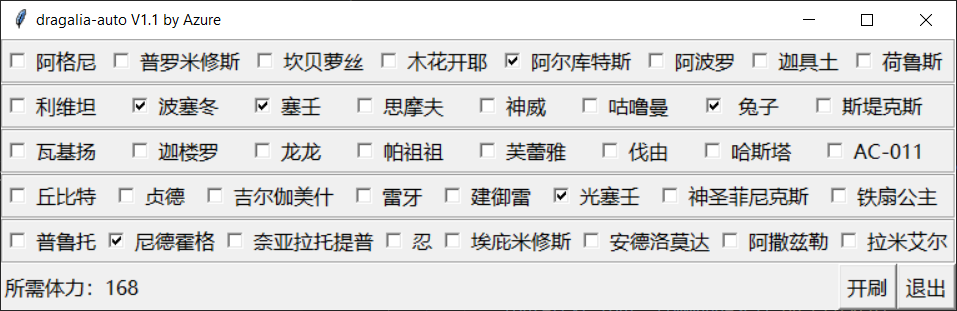

# dragalia-auto

<p align="center">
  
  <br>
  <b>主界面</b>
  <br><br>
</p>

原理是 Python + OpenCV + adb，所以**只支持安卓**。

现在一共40条龙玉龙，就算只刷有龙种的也要花好长时间，起码一个多小时就在那里点龙玉副本。但是我又想要那点蚊子腿，所以为了不被折磨，我就弄了个脚本来auto龙玉。

我测试了两天，都能非常顺利的自动刷完。

这个脚本是自用的，但是群里呼声挺高，就放出来看看。顺便也想看看有多少人愿意用，以及功能上的需求。

已知问题：
* 需要自己填坐标
    * 因为从设备抓取图片比较耗时，所以有些地方是直接点击预设坐标
    * 坐标只需要填一次
* 慢
    * 16条龙需要挂两个半小时，感觉还有一些进步空间
* 不处理升级界面
    * 刷龙玉的途中不能升级
    * 这个可以解决，但是我懒
* 不处理网络问题
    * 各位自行保持网络畅通吧。。。
    * 我也不清楚什么时候在哪儿会蹦出什么网络连接错误
* 不自动帮你吃体力药/买体力
    * 程序左下角有提前告知所需体力，请先吃好体力药再开始。

大家尽管提意见和建议，欢迎issue和pr。

# 使用说明

电脑需要安装：
* Python3.6或以上版本
    * Python最新版可以在[官网](https://www.python.org/downloads/)下载
* OpenCV（从pip安装）

如果你不知道什么是“从pip安装”，可以按照下面写的来操作。

同时按下`Win+R`，输入`cmd`，然后按回车。把下面的命令粘贴到弹出的黑框即可。
```
pip install opencv-python
```

电脑和手机的连接：
* 找一根USB线，把电脑和手机连上
* 然后在手机的“开发者模式”找到“USB调试”并开启
* 第一次调试通常会在手机上弹出一个确认框，同意即可
* 剩下的就交给程序吧~

如何在自己手机上获取坐标：
* 在手机的“开发者模式”找到“指针位置”，开启即可。
* 或者截图之后，在电脑上打开画图也能查看。

# 注意事项

本来我把这个仓库发到了某论坛的龙约版，结果吃了6天封禁。当然这个怪我，没仔细看清楚版规。那个论坛的原神版之前弹琴脚本讨论得热火朝天，我就想当然以为龙约版也可以。所以请大家不要在那个论坛提及本项目，有什么问题在这里开issue问即可。

# 更新

## 2021/07/01 - V1.0

dragalia auto 最基本功能的实现。测试了两天，都能非常顺利的自动刷完。

## 2021/07/02 - V1.1

* 用tkinter糊了一个简单的GUI
* 配置文件的读写
* 增加了对材料溢出的检测（说的就是你，银矿）